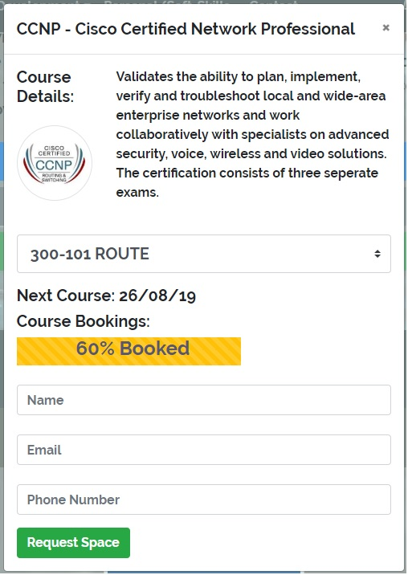
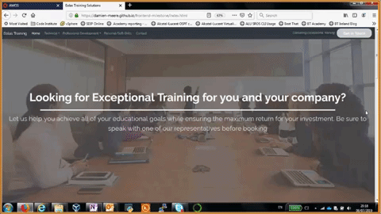
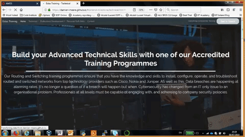
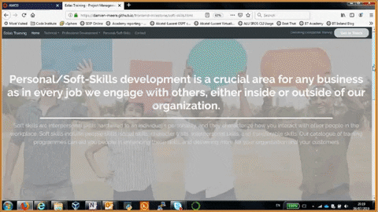
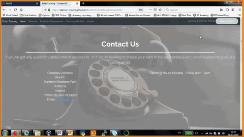

# Damien Meere - BT Ireland
User-Centric Frontend Development Milestone Project - Code Institute 

This project website will highlight my capability to employ the various tools illustrated through out the User-centric frontend development section of the Code Institute programme. 
This site will be a mock-up of a training company site. This will house information from three different strands of training - Technical, Management and Soft-Skills training. Each of sections is housed 
within it's own page. The dropdown menus within the navigation bar link to various sections within these strands. There is also a contact page with details of the company and a form with which to harness
feedback from users.

## Demo
A live demo can be found [Here](https://damien-meere.github.io/frontend-milestone/index.html)

## UX
My goal in developing this site to to make it easy for training candidates to access information on available training options, through a minimalist, sleek, easy-to-navigate site. 
This site is built to provide this capability regardless of the devices utilised to access the site. Therefore, throughout the site, two versions of content are presented. 
On larger screens, more verbose content is presented. However, on smaller screens, text is kept to a minimum, so as to ensure only the most pertinant information is shown.

For site users, both from an individual learner, or a company representative, I wanted to provide an overview of the training domains of this company (Technical, Professional/Organisational 
and Personal/Soft-Skills), in a very user friendly design. This is why the same site design was maintained throughout, with each page section filling the screen, so as to focus the user on that content.
I wanted users to be able to quickly target the requisite training domain, and specific programme they were looking to undertake. Through the course bookings modals, I also wanted to give the user a 
view of the course descriptions, upcoming course dates, and a view of the course uptake. This can be particularly useful in providing users with motivation to contirm their space on the programme. Within
a number of accreditations, there are numerous courses which must be undertaken to complete the accreditation. Therefore, within the bookings modals, I've included a dropdown options, to allow the user
to select the course they require.

## Technologies
1. HTML
2. CSS
3. Bootstrap (4.3.1)
4. FontAwesome
5. Google Font
6. JQuery

## Page Notes

### General Notes

The navbar is dynamic and will alter depending on the size of the screen employed to view the site. A 'Get in Touch' button is only available on large screens, however this contact functionality is 
also available via the contact page.

The footer contains details of the company's location. ON small screens this section contains a button that links away to google maps. The location called out is the BT offices in Dundrum. On larger
screens, this button is replaced with a map object. The footer also contains a section highlighting some popular courses via buttons. These buttons link to course booking modals (See Below):

### [index.html](index.html)

The Index page is a welcome page that introduces Eolas. This page introduces the main areas of the site, as well as illustrating the main certification partners, accessible through an image carousel.

### [technical.html](technical.html)

The Technical page is broken into five seperate sections, each of which fills the full screen. The first is a welcome panel describing the company's technical training services. The second is illustrates
the available Cisco programmes (CCNA, CCNP, CCIE). The buttons each link to a booking form modal (as ilustrated in the General Notes section). Some programmes are a composite of multiple training courses,
therefore there is a dropdown menu for users to book the requisite course. The third and fourth sections are similiar in structure to this, but cover Nokia and Cybersecurity offerings. The final section
contains a short demo video illustrating the potential for video training. Again, all sections are accessible directly via anchor links in the navbar.

### [professional.html](professional.html)

The Professional page is similiar in structure to the Technical page, except this page only has three sections, a welcome panel and two training panels covering Management training and Organisational
change training.

### [soft-skills.html](soft-skills.html)

Similare to the Professional and Technical pages, this page is broken into a Welcome panel and a training panel. Within the training panel, a nomber of available trainign options are highlighted, all related
to soft-skills/personal development.

### [contact.html](contact.html)

The Contact page contains two sections, the first of which calls out the location informationa and contact details for Eolas. The second panel presents the user with a Contact form. This form has some 
basic validation functionality, as described in the testing section. Upon successful submission of this form, a modal will pop-up to confirm that the message has been sent, and a training rep will 
be in touch.

## Current Features
This site uses the JSFiddle script to enable the alteration of booking modals, depending on the chosen programme.

I've created a number of response modals to illustrate an automated response to user inputs. This occurs when a user submits a request for a space within a course, or when the use uses the 'Get In Touch' Button
in the Navbar (visible on larger screens).There is currently no back-end to harness the user data, so this is merely in plasce to demonstrate this functionality.

I've included a section within the Technical page to illustrate the capability of Eolas to deliver Video Training programmes. The short video snippet I've embedded within the page is 60 seconds long 
and discusses the ARP Protocol in Networking. 

## Future Features 
In future, the booking form illustrating course availability progress bars, will be linked to a working database in order to give training candidates an accurate view of available space on the coure. 

At the moment, user inputs are acknowledged through automated reponse modals. In the next iteration of this site, user inputs will be harnessed from the booking forms and contact forms, and actioned within
the back-end of the site. Rather than a notification that a company representative will be in contact, that input will be validated, and stored within the back-end database, and reflected in the 
course availability progress bars.

## Testing
The site user story outcomes achieved the originally intended outcomes, in providing them with a view to the training capabilities of 'Eolas', and specifically illustrating the programmes delivered. 
Within each section (Technical, Professional/Organisational and Personal/Soft-Skills), the user is presented with a breakdown of all available programmes. On clicking the requisite course button, the user
is presented with a modal, housing a course description (occasionally a course selector for accreditations comprising multiple parts), and a view of the course availability. As well as this there is a 
form for them to complete to request a space on the course. On completiong of this form, the user is presented with a modal calling out that a training rep will be in contact within 24 hours. The plan for 
this functionality is called out in the 'Future Features' section.

All CSS and HTML files were passed through code validators. The [CSS Validator](https://jigsaw.w3.org/css-validator/) & [HTML Validator](https://validator.w3.org) checked the markup validity of Web documents 
against the w3c standards. On each page, there is an ongoing error "Attribute aria-valuamin not allowed on element div" related to the use of [Bootstrap Progress Bars](https://getbootstrap.com/docs/4.3/components/progress/). 
However, the aria-valuemin is required for the progress bar element to work. So these apparent errors do remain.

I've impletemented a basic script to validate inputs to the contact form. This enforces the inclusion of input to the 'Name' field, as well a proper valid formatting for the 'Email' field. An error notification
is returned should there be missing, or invalid data entered. The 'required' attribute is added to each of the 'name,' 'email,' and 'message' fields, so if those fields are not filled in, the form will 
not submit. If all fields are completed with valid information, on submission, a notification Modal will appear to let the user know that the training rep from Eolas will be contact with 24 hours to 
confirm their position on the programme.

All links will open in a new tab using 'target="_blank"'.  All links have been manually tested to ensure that they are pointing to the correct destination.

Links to various social media platforms are highlighted in the page footers (i.e. LinkedIn profile, GitHub, twitter etc.). These are provided to illustrattive purposes. I've not built social media 
profiles for this training company, so these links refer directly to each platform's homepage.

This site was tested across multiple browsers (Chrome, Safari, Firefox), and on multiple devices (Samsung Galaxy S8/S9/S10, Samsung Galaxy Tab, Apple iPad, iPhone 6/7/8) to ensure compatibility 
and responsiveness.

## Deployment
This site is hosted using GitHub pages, deployed directly from the master branch. The deployed site will update automatically upon new commits to the master branch. 
In order for the site to deploy correctly on GitHub pages, the landing page is named `index.html`.

To run locally, you can clone this repository directly into the editor of your choice by pasting `git clone https://github.com/damien-meere/frontend-milestone.git` into your terminal. 
To cut ties with this GitHub repository, type `git remote rm origin` into the terminal.

### Media
<!--INclude details of image locations (BT??)-->
A number of photos were taken from [Pexels](https://www.pexels.com/), a stock image library. In particular, the main images behind the jumbotrons throughout the site.

### Acknowledgements
<!--Achnowledge any third-party utilities employed in the development of this site-->
The JSFiddle Javascript function, which is used to alter the contents of the course booking modals based on the selection of the dropdown menu can be found [Here](http://jsfiddle.net/TLBvx/252/).

Adobe Color Wheel [Found Here](https://color.adobe.com/create) utilised to align color schemes.

### Content
Most of the content on the site was written by me. However, there are course details & desctiptions on the site that apply to real-world certifications and accreditations. As such, in some cases, 
the content on the site is an adapted version of these desctiptions.

**This site is for educational purposes**