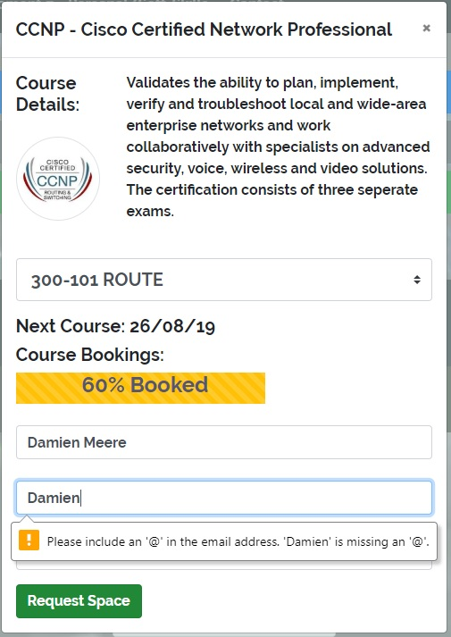
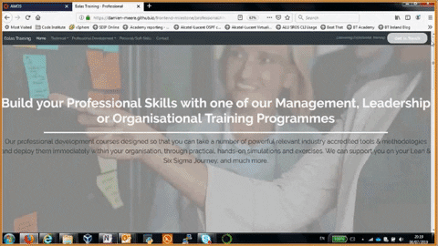

# Damien Meere - BT Ireland
User-Centric Frontend Development Milestone Project - Code Institute 

This project website will highlight my capability to employ the various tools illustrated through out the User-centric frontend development section of the Code Institute programme. 
This site will be a mock-up of a training company site. This will house information from three different strands of training - Technical, Management and Soft-Skills training. Each of sections is housed 
within it's own page. The dropdown menus within the navigation bar link to various sections within these strands. There is also a contact page with details of the company and a form with which to harness
feedback from users.

### Table of Contents

- [Demo](#Demo)
- [UX + User Stories](#UX+User-Stories)
- [Technologies](#Technologies)
- [Page Notes](#Page-Notes)
- [Current Features](#Current-Features)
- [Future Features](#Future-Features)
- [Testing](#Testing)
- [Testing -  Unresolved Bugs](#Testing-Unresolved_Bugs)
- [Deployment](#Deployment)
- [Media](#Media)
- [Acknowledgements](#Acknowledgements)
- [Content](#Content)

## Demo
A live demo can be found [Here](https://damien-meere.github.io/frontend-milestone/index.html)

## UX+User-Stories
My goal in developing this site to to make it easy for training candidates to access information on available training options, through a minimalist, sleek, easy-to-navigate site. Therefore, in designing
this site, I started with a numeber of user stories:

1. As a prospective student, I want to be able to identify if this provider delivers training in the area I'm looking for.
2. As a user I want to be able to quickly identify if the specific course I'm looking to undertake is available.
3. As a user, I want to be able to determine when a particular course will run, and whether there is any space available on that particular iteration.

From these user-stories it was clear that quick and easey access to information would be key to ensuring that users choose 'Eolas' as their training provider. I needed to make sure that users could quickly
navigate the site, and locate any information they required with minimal prompting. As illustrated by the images in the [wireframe folder](https://github.com/damien-meere/frontend-milestone/tree/master/wireframes), 
particularly the index_design images, even from the early designs, I wanted to ensure the site was easy-to-navigate and minimalist to ensure the user was able to quickly assimilate the information 
required. Also within this wireframe folder is a numeber of designs for both the navbar (full and collpsed) and footer, as well as designs for the course booking modals so prevalent throughout the site.
The Technical training page design is also illustrated here, with this scrollable panelled format being repeated throughout the site in the other pages.

This site is built to provide ease of access to information regardless of the devices utilised to access the site. Therefore, throughout the site, two versions of content are presented. 
On larger screens, more verbose content is presented. However, on smaller screens, text is kept to a minimum, so as to ensure only the most pertinant information is presented. Every effort has been
made to ensure that this doesn't negatively effect the user's utilisation of the site, and that all requisite information is still effectively conveyed to the site visitor. In some cases, the alteration
of content was in direct response to bugs encountered during the site development, details of which are discussed within the Testing

For site users, both from an individual learner, or a company representative, I wanted to provide an overview of the training domains of this company (Technical, Professional/Organisational 
and Personal/Soft-Skills), in a very user friendly design. This is why the same site design was maintained throughout, with each page containing a number of sections that fill the screen, 
so as to focus the user on that content. Users are able to quickly target the requisite training domain (via the navbar or through section links on the homepage), and identify specific programmes 
they were looking to undertake. 

I have employed a number of course bookings modals throughout the site, in order to give the user a view of the course descriptions, upcoming course dates, and a view of the course uptake. This can be 
particularly useful in providing users with motivation to confirm their space on the programme. Within a number of accreditations, there are numerous courses which must be undertaken to complete 
the accreditation. Therefore, within the bookings modals, I've included dropdown options, to allow the user to select the course they require.

On submission of forms throughout the site, a user response modal is presented to acknowledge the input from the user. Within this modal, it's again highlighted that a company representative will be in 
contact with the user to confirm details. As highlighted in the upcoming 'Future Features' section, this will be connected to a suitable backend in the next iteration of the site.

## Technologies
1. HTML
2. CSS
3. Bootstrap (4.3.1)
4. FontAwesome
5. Google Font
6. JQuery

## Page-Notes

### General Notes

The navbar is dynamic and will alter depending on the size of the screen employed to view the site. A 'Get in Touch' button is only available on large screens, however this contact functionality is 
also available via the contact page.

The footer contains details of the company's location. On small screens this section contains a button that links away to google maps. The location called out is the BT offices in Dundrum. On larger
screens, this button is replaced with a map object. The footer also contains a section highlighting some popular courses via buttons. These buttons link to course booking modals (See Below):

Modals such as this are utilised throughout the site to present more specific information on individual programmes, such as course description and current uptake. Within these modals the user can
input there contact information and resquest a space on a programme. The user inputs in these forms, and all other forms on the site are validated, as illustrated in the image below, so as to ensure
proper user data is harnessed.

### [index.html](https://damien-meere.github.io/frontend-milestone/index.html)

The Index page is a welcome page that introduces Eolas. This page introduces the main areas of the site, as well as illustrating the main certification partners, accessible through an image carousel.

### [technical.html](https://damien-meere.github.io/frontend-milestone/technical.html)

The Technical page is broken into five seperate sections, each of which fills the full screen. The first is a welcome panel describing the company's technical training services. The second is illustrates
the available Cisco programmes (CCNA, CCNP, CCIE). The buttons each link to a booking form modal (as ilustrated in the General Notes section). Some programmes are a composite of multiple training courses,
therefore there is a dropdown menu for users to book the requisite course. The third and fourth sections are similiar in structure to this, but cover Nokia and Cybersecurity offerings. The final section
contains a short demo video illustrating the potential for video training. Again, all sections are accessible directly via anchor links in the navbar.

### [professional.html](https://damien-meere.github.io/frontend-milestone/professional.html)

The Professional page is similiar in structure to the Technical page, except this page only has three sections, a welcome panel and two training panels covering Management training and Organisational
change training.

### [soft-skills.html](https://damien-meere.github.io/frontend-milestone/soft-skills.html)

Similare to the Professional and Technical pages, this page is broken into a Welcome panel and a training panel. Within the training panel, a nomber of available training options are highlighted, all related
to soft-skills/personal development.

### [contact.html](https://damien-meere.github.io/frontend-milestone/contact.html)

The Contact page contains two sections, the first of which calls out the location informationa and contact details for Eolas. The second panel presents the user with a Contact form. This form has some 
basic validation functionality, as described in the testing section. Upon successful submission of this form, a modal will pop-up to confirm that the message has been sent, and a training rep will 
be in touch.

## Current-Features
This site uses the JSFiddle script to enable the alteration of booking modals, depending on the chosen programme.

I've created a number of response modals to illustrate an automated response to user inputs. This occurs when a user submits a request for a space within a course, or when the use uses the 'Get In Touch' Button
in the Navbar (visible on larger screens).There is currently no back-end to harness the user data, so this is merely in plasce to demonstrate this functionality.

I've included a section within the Technical page to illustrate the capability of Eolas to deliver Video Training programmes. The short video snippet I've embedded within the page is 60 seconds long 
and discusses the ARP Protocol in Networking. 

## Future-Features 
In future, the booking form illustrating course availability progress bars, will be linked to a working database in order to give training candidates an accurate view of available space on the coure. 

At the moment, user inputs are acknowledged through automated reponse modals. In the next iteration of this site, user inputs will be harnessed from the booking forms and contact forms, and actioned within
the back-end of the site. Rather than a notification that a company representative will be in contact, that input will be validated, and stored within the back-end database, and reflected in the 
course availability progress bars.

Improved validation of all user inputs is required. For example, at the moment, on submisson of the form within the 'Get In Touch' button, the user is presented with the submission modal to say a 
rep will be in contact, regardless of input. As yet, there is no validation of the inputted information, or checks as to whether information is inputted at all. In future, all input from users will need
to be effectively validated to ensure clean information makes it to the site backend database. This includes the effecive checking of emails to ensure they are valid.

## Testing
The site user-story outcomes achieved the originally intended outcomes, in providing them with a view to the training capabilities of 'Eolas', and specifically illustrating the programmes delivered. 
Within each section (Technical, Professional/Organisational and Personal/Soft-Skills), the user is presented with a breakdown of all available programmes. On clicking the requisite course button, the user
is presented with a modal, housing a course description (occasionally a course selector for accreditations comprising multiple parts), and a view of the course availability. As well as this, there is a 
form for them to complete to request a space on the course. On completiong of this form, the user is presented with a modal calling out that a training rep will be in contact within 24 hours. The plan for 
this functionality is called out in the 'Future Features' section. In order to effectively validate this process, I gave access to a a number of users, and asked them to navigate and request access to a 
particular course. In all cases, the user was able to quickly navigate to the requisite area on the site, without any prompt or direction. This process effectively validated the design of the site, and 
highlighted the achievement of the original user-story outcomes.

All CSS and HTML files were passed through code validators. The [CSS Validator](https://jigsaw.w3.org/css-validator/) & [HTML Validator](https://validator.w3.org) checked the markup validity of Web documents 
against the w3c standards. On each page, there is an ongoing error "Attribute aria-valuamin not allowed on element div" related to the use of [Bootstrap Progress Bars](https://getbootstrap.com/docs/4.3/components/progress/). 
However, the aria-valuemin is required for the progress bar element to work. So these apparent errors do remain.

Within every form on the site, there is validation on all user inputs. This enforces the inclusion of inputs to the 'Name' field, proper valid formatting for the 'Email' field, and where required, enforces
the input of a message. An error notification is returned should there be an element missing, or invalid data entered. The 'required' attribute is added to each of the requisite fields, so if those 
fields are not filled in, the form will not submit. If all fields are completed with valid information, on submission, a notification Modal will appear to let the user know that the training rep 
from Eolas will be contact with 24 hours to confirm their position on the programme or respond to their message. I've implemented a script that allows the submission or response modals to be called 
when specified after a '#' within the page's URL. So, for example, on submission of the form on the contact page, the following URL is called -'contact.html#submissionModal', this calls the contact 
page with the modal overlayed as illustrated [HERE](https://damien-meere.github.io/frontend-milestone/contact.html#submissionModal). The request response modal on submission of a course request modal
appears as illustrated [HERE](https://damien-meere.github.io/frontend-milestone/technical.html?#requestResponseModal).

All external links will open in a new tab using 'target="_blank"'.  All external links have been manually tested to ensure that they are pointing to the correct destination.

Internal links on each page were individually tested to ensure they navigated to the requisite page. Within the navbar, within link dropdowns, the links navigate to specific anchors within a particular
page, so as to allow users to quickly navigate to the requiste area on the site. 

Links to various social media platforms are highlighted in the page footers (i.e. LinkedIn profile, GitHub, twitter etc.). These are provided to illustrative purposes. I've not built social media 
profiles for this training company, so these links refer directly to each platform's homepage so as to demonstrate the functionality.

This site was tested across multiple browsers (Chrome, Safari, Firefox), and on multiple devices (Samsung Galaxy S8/S9/S10, Samsung Galaxy Tab, Apple iPad, iPhone 6/7/8) to ensure compatibility 
and responsiveness. In testing the site across multiple browsers and devices, a number of faults were brought to the fore. In particular, on many of the pages, on certain screen sizes, a white space
would appear to the right of the page. I identified that this was caused by section headings being too large for the screen in smaller resolutions. Therefore, throughout the site, I implemented versions
of section heads for both large screens and small. When the site width is being reduced, once a certain threshold is met, the headers will shift. The smaller headers are beter suited to the small screens,
and ensured all elements fit within the requisite space.

## Testing-Unresolved_Bugs
When a users zooms in on a page (settings within the users own browser), this can effect the placement of elements within a page. In some cases, jumbotrons can begin to overlap and 
obscure certain elements. 

## Deployment
This site is hosted using GitHub pages, deployed directly from the master branch. The deployed site will update automatically upon new commits to the master branch. 
In order for the site to deploy correctly on GitHub pages, the landing page is named `index.html`, and the current live site can be accessed [HERE](https://damien-meere.github.io/frontend-milestone/index.html)

To run locally, you can clone this repository directly into the editor of your choice by pasting `git clone https://github.com/damien-meere/frontend-milestone.git` into your terminal. 
To cut ties with this GitHub repository, type `git remote rm origin` into the terminal.

You can also Clone this Repository to GitHub Desktop, but navigating to the [main page](https://github.com/damien-meere/frontend-milestone) of the repository on GitHub, under the repository 
name, click Clone or download. Click Open in Desktop to clone the repository and open it in GitHub Desktop. Click Choose... and, using Windows Explorer, navigate to a local path where you 
want to clone the repository. For more information you can review the [GitHub site](https://help.github.com/en/articles/cloning-a-repository#cloning-a-repository-to-github-desktop).

### Media
A number of photos were taken from [Pexels](https://www.pexels.com/), a stock image library. In particular, the main images behind the jumbotrons throughout the site.

### Acknowledgements
The JSFiddle Javascript function, which is used to alter the contents of the course booking modals based on the selection of the dropdown menu can be found [Here](http://jsfiddle.net/TLBvx/252/).

[Adobe Color Wheel](https://color.adobe.com/create) utilised to align color schemes.

### Content
Most of the content on the site was written by me. However, there are course details & desctiptions on the site that apply to real-world certifications and accreditations. As such, in some cases, 
the content on the site is an adapted version of these desctiptions.

**This site is for educational purposes**